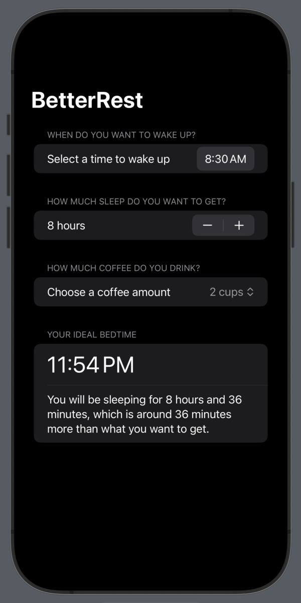

# BetterRest
BetterRest is a simple IOS mobile application that recommends optimal sleep times based on preferred wake time, desired sleep duration, and amount of coffee consumed. It is based on machine learning and was developed with Apple Core ML and Create ML.

## Example

